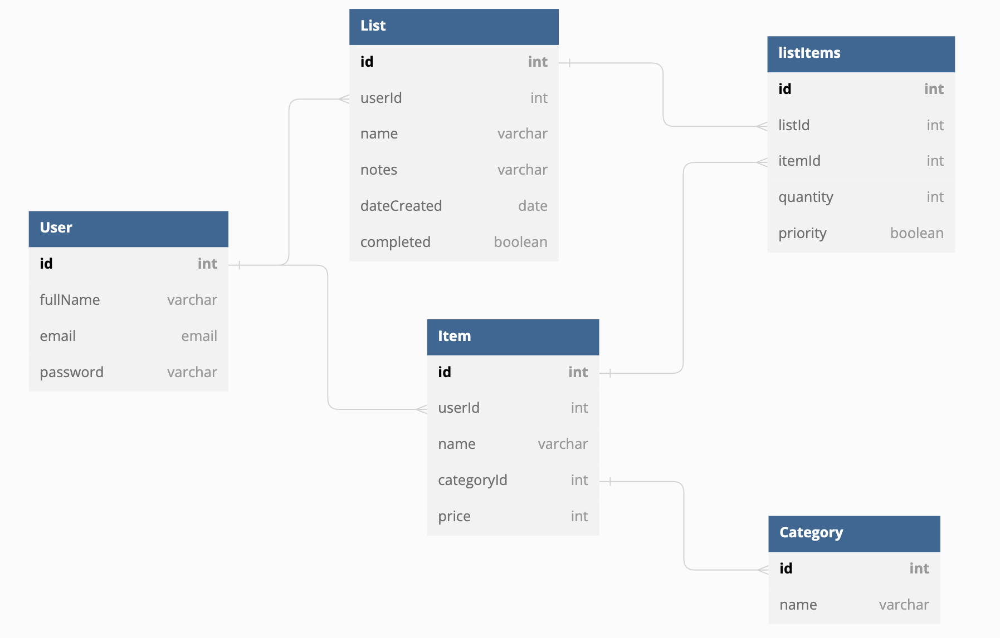

# Welcome to PantryCheck 

> A tool designed to ease the burden of planning your next trip to the grocery store  ( o˘◡˘o) ┌iii┐ ( ・・)つ-●●●

### Application Overview

For some, grocery shopping is stressful and time-consuming. It can be hard to keep track of what’s in your pantry, and even more difficult to keep in mind the shelf-lives of various items. Adequately planning for your next run to the grocery store can save you time and money.

My main goal for this application was to gain a deeper understanding of how to utilize Django Models to build an interface with a sufficient relational database.

## Features

Features include:
* Users can add, edit and delete personalized grocery items to their profile
* Users can create, edit and delete grocery lists
* Users can add grocery items to their grocery lists, and subsequently edit or remove them
* Users can search for grocery items in the search bar
* Users can filter items on their list by their category and/or priority value

## ERD

## Public Link
https://netlify--sparkling-pasca-2d369e.netlify.app

 Use the provided login credentials *OR* Create your own user profile

## Author

Created by Jordan Victoria 

 
